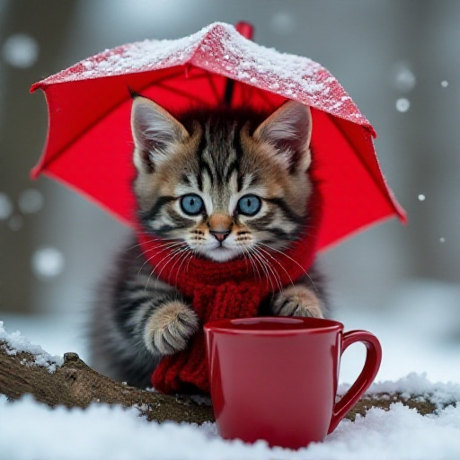

# 手绘风
##
```cn
手绘风格。（5个女孩在一旁观看和相互玩耍），全身（劳瑞：1.2），露营，野餐，烧烤，冬季，雪，夜晚，儿童插画，杰作，最高品质。
```

```en
Hand-drawn style.(5 girls watching and playing with each other), whole body (Laurie: 1.2), camping, picnicking, barbecue, barbecue, winter, snow, night, children's illustrations, masterpiece, best quality,
```


##
```cn
动漫风格，日本动漫风格，或漫画风格。一群孩子，河边野餐，交谈，未来，快乐，多彩。
```

```en
Anime style, Japanese anime style, or Manga style.group of children,riverside picnic,conversation,future,happy,colorful,
```


##
```cn
3D风格，数字“7”和“5”以精致的金线绘制。数字“7”上覆盖着故宫、天坛、长城和牡丹花的图案，而数字“5”上覆盖着现代中国地标、火箭、熊猫、烟花以及一群人放飞气球的场景。数字的边缘被金色的丝带云环绕。
```

```en
In a 3D style, the numbers "7" and "5" are drawn with intricate gold threads. The number "7" is adorned with patterns of the Forbidden City, Temple of Heaven, Great Wall, and peony flowers, symbolizing ancient Chinese culture and natural beauty. On the other hand, the number "5" showcases modern Chinese landmarks, rockets, pandas, fireworks, and a scene of people releasing balloons together, representing contemporary China's progress and joy. The edges of these numbers are surrounded by golden ribbon-like clouds, adding an extra layer of splendor and magnificence to the overall design.
```


##
```cn
QQ，一张可爱的小灰虎斑 kitten 的照片，它正抱住一根树枝，围着一条舒适的红色针织围巾，并撑着一把红色的小雨伞。kitten 表情既可爱又专注，雪花轻轻飘落，营造出一个宁静的冬日场景。小猫旁边放着一个溢出热饮的小红杯子，背景是模糊的，突出了小猫并增添了梦幻般的氛围。色彩温暖诱人，与寒冷的冬日环境形成了对比。QQ，
```
```en
QQ,QQ,a cute photograph of a small,fluffy grey tabby kitten clinging to a branch,wearing a cozy red knitted scarf and holding a red umbrella over itself,the kitten has a cute and focused expression,snowflakes are falling gently,creating a tranquil winter scene,a small,overflowing red mug sits beside the kitten,the background is blurred,emphasizing the kitten and adding a dreamy atmosphere,the colors are warm and inviting,contrasting with the chilly winter setting,QQ,
```

